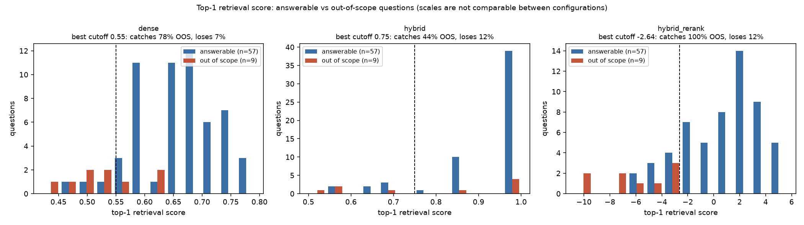

# Phase 4 — the confidence threshold that was not needed

**Date:** 2026-08-18
**Script:** `python src/score_distribution.py`
**Artefacts:** `reports/runs/2026-08-18T093939Z-score-distribution.png`,
`reports/runs/2026-08-18T093939Z-score-separation.json`
**Run analysed:** `2026-08-18T093939Z` (62 documents, 66 questions)

---

## The finding that made the phase unnecessary

Phase 4 was planned as: plot the retrieval score distributions, pick a
cutoff, then measure what the threshold costs and buys — fabrications
removed against correct answers lost.

**There are no fabrications to remove.**

| Config | Fabrications observed (out_of_scope, n=9) |
|---|---|
| `dense` | **0 / 9** |
| `hybrid` | **0 / 9** |
| `hybrid_rerank` | **0 / 9** |

Across 27 out-of-scope questions asked, **not one was answered instead
of escalated.** The generation prompt refused every time, in every
configuration, including the cases where retrieval returned confidently
wrong documents — `dense` on q25 ("Do you offer laser hair removal?")
retrieved four facial documents and still declined.

**At this scale and on this corpus, fabrication is not the dominant
failure mode.** The dominant failure mode is retrieving the wrong member
of a confusable cluster and answering with the wrong figure — which a
confidence threshold does not address at all, because those answers come
back with *high* scores, not low ones.

A threshold applied here would be all cost and no benefit: it could only
remove correct answers.

### Honest limits on that claim

**No fabrication observed on 9 out-of-scope questions** per configuration
**cannot be distinguished from a merely low rate**. By the rule of three,
the 95% confidence interval on 0/9 extends to roughly **33%**.
What is established is that fabrication is not frequent enough to be the
thing worth engineering against here — not that it never happens.

The result is also specific to this generation prompt, which is
deliberately blunt about declining, and to a corpus where the
out-of-scope subjects are genuinely absent rather than partially
covered.

---

## The transferable question: would a threshold work at all?

Nothing to cut here does not mean nothing to learn. The plot answers the
question that carries to a real corpus, where the generator will not be
so well behaved: **do out-of-scope questions actually score lower than
answerable ones?** If they do not, a confidence threshold is not
implementable regardless of how much fabrication there is to catch.

The top-1 retrieval score is used, because that is what a threshold
would test. **Scores are not comparable between configurations** —
cosine similarity, an RRF score and a cross-encoder logit are three
different scales — so each is analysed on its own axis.

| Config | Answerable (mean) | Out-of-scope (mean) | Best cutoff | Catches | Costs |
|---|---|---|---|---|---|
| `dense` | 0.658 | 0.531 | 0.550 | 78% of OOS | 7% of answerable |
| `hybrid` | 0.922 | 0.796 | 0.750 | **44%** of OOS | 12% of answerable |
| `hybrid_rerank` | 0.836 | −5.977 | −2.635 | **100%** of OOS | 12% of answerable |

**No configuration achieves a clean gap** — in all three, the highest-
scoring out-of-scope question outscores the lowest-scoring answerable
one. A threshold is always a trade, never a free filter.

### The reranker score is a usable confidence signal

`hybrid_rerank` separates the two populations by a wide margin:
answerable questions average **+0.84**, out-of-scope average **−5.98**.
A cutoff at −2.64 catches **every** out-of-scope question for 12% of
answerable ones.

That is the phase 4 result worth keeping. A cross-encoder produces a
*calibrated relevance judgement* — it scores the question against the
document text directly — so a low score genuinely means "this document
does not answer this question". On a corpus where fabrication *is* a
problem, this is the signal to threshold on.

### The RRF score is not

`hybrid` is the worst of the three, catching **44%** of out-of-scope
questions for a higher cost than `dense` pays to catch 78%.

The reason is structural, not incidental. **An RRF score is a rank
fusion artefact, not a similarity.** It is computed from the positions a
document occupied in the two candidate lists, so a document that ranks
first in both branches scores at the maximum whether or not it has
anything to do with the question. The histogram shows exactly that: a
tall spike at 1.0 containing both answerable *and* out-of-scope
questions. There is nothing there to threshold on.

This matters beyond this benchmark: a system that fuses with RRF and
then thresholds on the fused score is thresholding on noise.

---

## What was decided

**No threshold is adopted**, and `SCORE_THRESHOLD` stays unset. Adopting
one would remove correct answers to prevent fabrications that do not
occur.

`src/score_distribution.py` is kept so the analysis reruns against any
future corpus. If fabrication ever becomes non-zero, the cutoff to use
is a reranker score, and the table above is the starting point.
